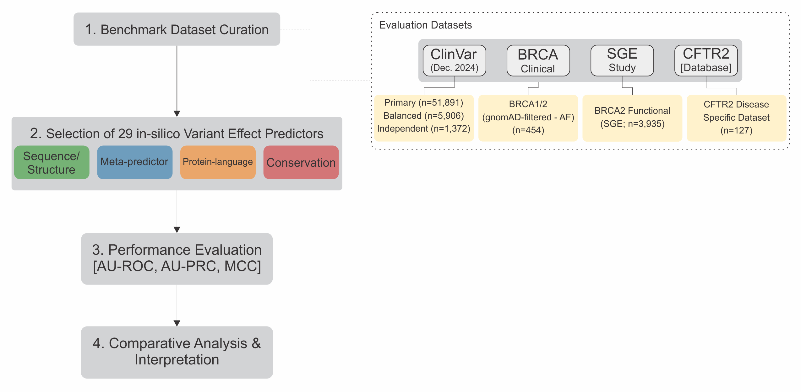
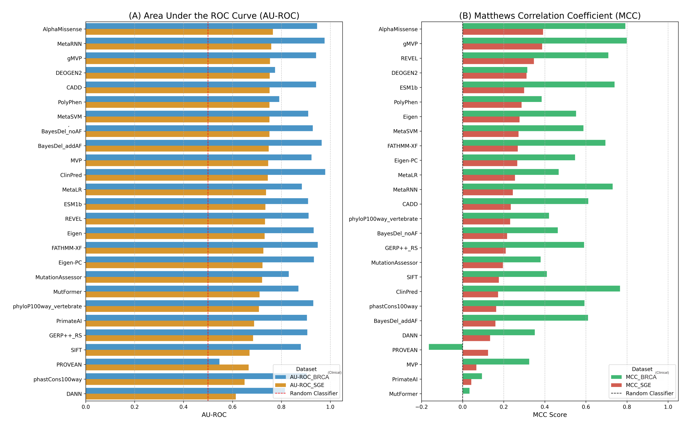

# Evaluating the Performance of Variant Effect Predictors: A Comprehensive Analysis Utilizing Clinical and High-throughput Functional Data

This repository serves as a supplementary archive for our manuscript, "Evaluating the Performance of Variant Effect Predictors: A Comprehensive Analysis Utilizing Clinical and High-throughput Functional Data". It contains key scripts, results, and figures presented in the study.

In this study, we performed a rigorous, multifaceted performance validation of 29 widely used *in-silico* pathogenicity predictors. Our findings identify the most reliable predictors for clinical application but also uncover a significant disparity in model performance between clinical and functional benchmarks, providing a vital guide for the informed application of these powerful models in advanced genomic medicine. 

## Study Workflow
Here us the overall workflow of our study, from data curation to interpretation:

## Repository Contents
This repository is organized as follows:
-   `code/`: Contains key analysis scripts for performance evaluation and figure generation.
-   `results/figures/`: Contains all figures presented in the manuscript in high-resolution format.
-   `results/tables/`: Contains supplementary tables with detailed performance metrics (e.g., MCC, AU-ROC) for all predictors.

## Key Results Showcase

Below are the key findings from our analysis.

## Figures Showcase

This section provides an overview of the key figures from our manuscript. All high-resolution figures are available in the `results/figures/` directory.

| Preview                                       | Figure Number & Title                                      | Description                                                                                             |
| :-------------------------------------------- | :--------------------------------------------------------- | :------------------------------------------------------------------------------------------------------ |
|         | **Figure 1:** Overview of the benchmark workflow used for the comprehensive evaluation of in silico pathogenicity predictors.	| The workflow comprises currated benchmark datasets from four primary sources: ClinVar-dervied clincial datasets, BRCA1/BRCA2 gene-specific clinical dataset deived from gnomAD with ClinVar-based labels, BRCA2 functional dataset from a saturation genome-editing study, and a disease-specific clinical dataset from CFTR2. Al lvariants were harmonized to GRCh38 genome coordinates and annotated using a standardized coordinate-based workflow. These datasets were used to evaluate the performance of 29 predictors, group by methodological cateogry, using AUROC, AUPRC, and MCC, followed by a comparative analysis across clinical and functional benchmarks.            |
|  | **Figure 2:** Data completeness across 29 variant effect predictors on ClinVar-derived clinical benchmarks.                            | Bar plots show the percentage of variants with missing prediction scores under the standardized GRCh38 coordinate-based annotation workflow. Missing predictions scores not shown for balanced ClinVar subset because it was constructed as a complete-case dataset with scores available for all predictors by design. |
|         | **Figure 3:** Receiver operating characteristic (ROC) curves comparing 29 predictors across ClinVar-derived clinical benchmarks.  	| (A) Primary ClinVar benchmark (December 2024; n =51,891). (B) Balanced ClinVar complete-case subset (n = 5,906), constructed to include equal numbers of pathogenic and benign variants with prediction scores available for all predictors. (C) Temporal ClinVar validation datset (January—May 2025; n = 1,372). Across datasets, MetaRNN shows consistently high discrimination, with ClinPred and BayesDel_addAF among the strongest performers on the clinical benchmarks.            |
|         | **Figure 4:** Comparative performance of variant effect predictors by methodological category across ClinVar-derived evaluation datasets. 	| Box-and-strip plots summarize AUROC values by predictor category; box represent the distribution across tools within each category, and points indicate dataset-specific AUROC values for individual tools. Overall, meta-predictors shows the highest median AUROC and the most consistent performance across ClinVar benchmarks, with top-ranked models predominantly drawn from this category (MetaRNN, BayesDel, and ClinPred).mance at recommended thresholds and stratification by allele frequency. 	| Sensitivity versus specificity for each predictor at its recommended threshold on the (A) ClinVar primary dataset, (B) Clinvar balanced subset, and (C) Independent datasets. Top-tier meta-predictors consistently achieve high performance, clustering in the top-right corner. (D) AU-ROC performance of the top-performing models stratified by gnomAD allele frequency 9AF) bins. All models shows the highest AU-ROC on the rarest variants (singletons), with performance generally decreasing for more common variants, a known challenge in variant interpretation.              |
|         | **Figure 6:** Comparative performance of predictors on gene-specific clinical versus high-throughput functional benchmarks in BRCA genes. 	| Predictor were evaluated on (i) a BRCA1/BRCA2 clinical benchmark comprising rare missense variants observed in gnomAD with ClinVar-derived germline classifications, and (ii) BRCA2 saturation genome-editing (SGE) benchmark with experimentally derived functional labels. (A) AUROC summarizing discrimination performance. Models are ordered by performance on the SGE benchmark. (B) MCC summarizing threshold-dependent classification performance at author-recommended thresholds.            |

## Benchmark Datasets 
Due to their large file size, the benchmark datasets analyzed in this study are not hosted on this GitHub repository. The full datasets are available from the author upon reasonable request.
  
**How to Request Data:**
To request access, please email [Syed Hassan Abbas] at [abbas.hassan@stu.ecnu.edu.cn] with a brief description of your intended research use. The datasets will be provided in `.csv` format. In all files, the ground truth labels are in a column named `Label` (1 = Pathogenic, 0 = Benign).

#### Dataset Descriptions:
-   **ClinVar Datasets:** Derived from the ClinVar database (accessed [Dec, 2024]). Includes a primary imbalanced set, a balanced subset, and a temporal validation set (variants submitted [Jan, 2025] to [May, 2025]) to reduce non-circularity.
-   **BRCA Clinical Dataset:** A gene-specific set of missense variants in *BRCA1* and *BRCA2*. Variants with high-confidence clinical classifications from ClinVar were retained and subsequently filtered to remove common variants found in gnomAD (AF > [1%]).
-   **BRCA2 SGE Functional Dataset:** A large-scale experimental dataset derived from a saturation genome editing study of *BRCA2* [1].
-   **CFTR2 Disease-Specific Dataset:** A high-confidence set of CF-causing and non-CF-causing variants from the CFTR2 database (https://cftr2.org/). 

## Citation
If you find our work useful, please cite our paper:
> **[Syed Hassan Abbas, et al. (Year). Evaluating the Performance of Variant Effect Predictors: A Comprehensive Analysis Utilizing Clinical and High-throughput Functional Data. *Journal Name*.]**

## Reference
1. Sahu S, Galloux M, Southon E, Caylor D, Sullivan T, Arnaudi M, et al. Saturation genome editing-based clinical classification of BRCA2 variants. Nature. 2025;638(8050):538-45.

## Contact 
For questions about the paper or data, please contact [Syed Hassan Abbas] at [abbas.hassan@stu.ecnu.edu.cn] or open an issue in this repository.
