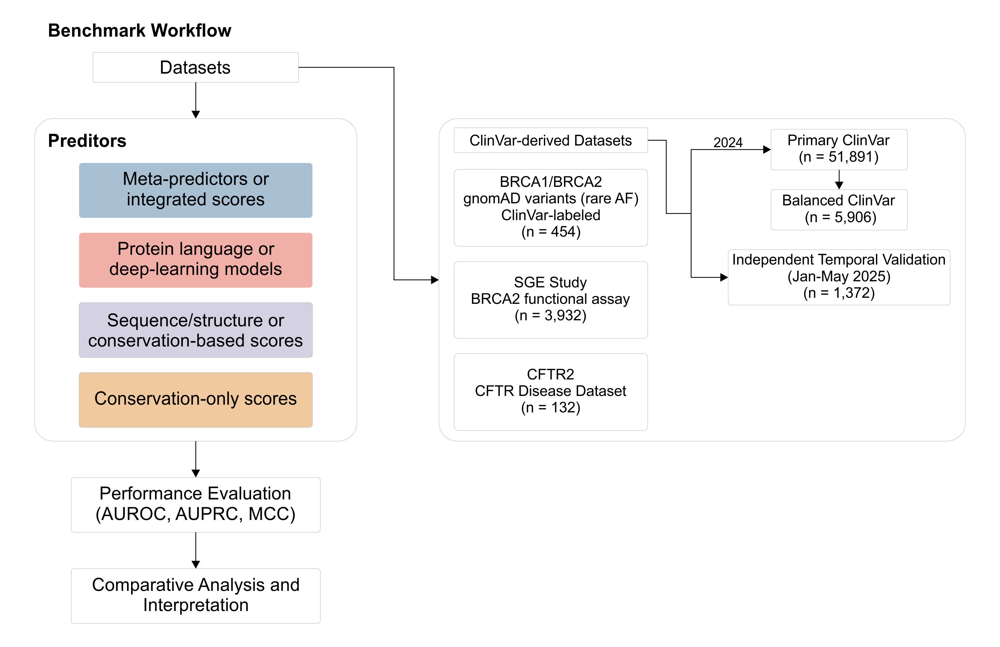
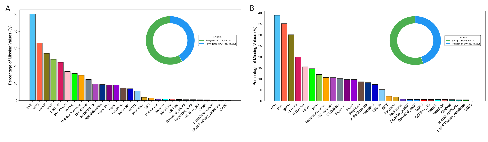
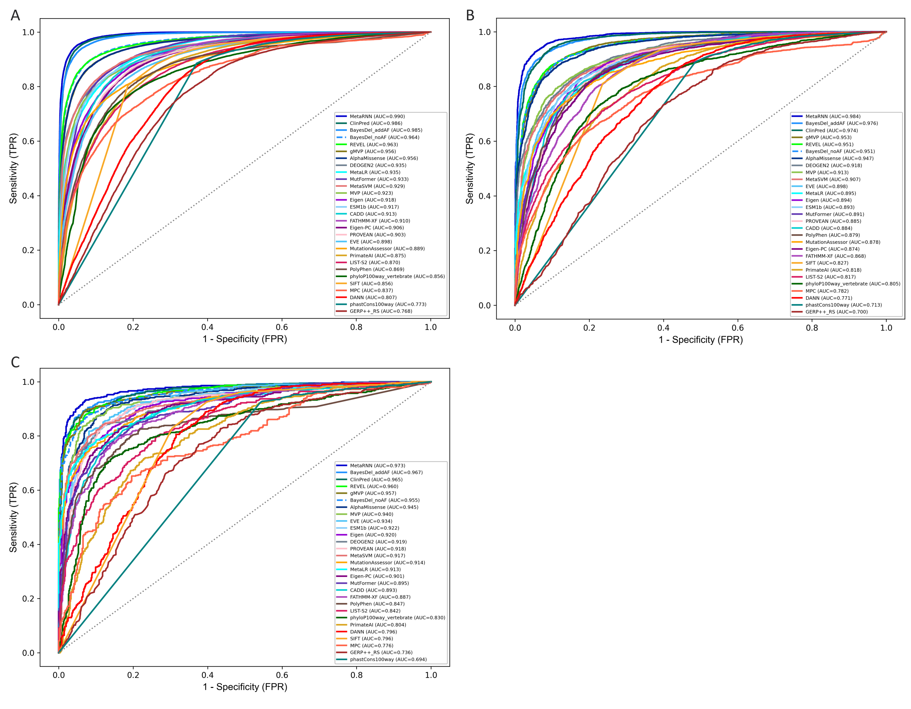
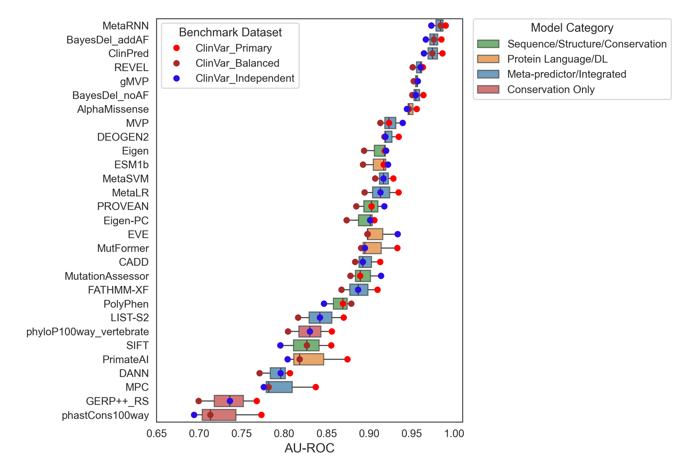
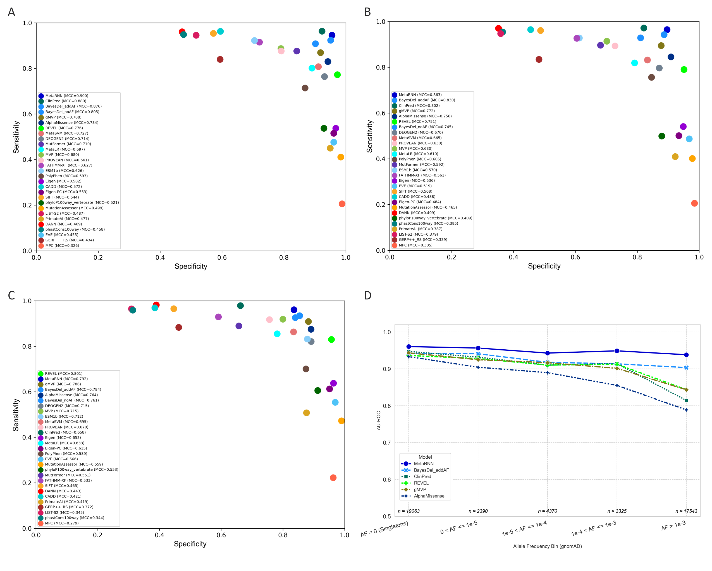

# Evaluating the Performance of Variant Effect Predictors: A Comprehensive Analysis Utilizing Clinical and High-throughput Functional Data

This repository provides supplementary archive for the manuscript: **"Evaluating the Performance of Variant Effect Predictors: A Comprehensive Analysis Utilizing Clinical and High-throughput Functional Data". It includes analysis scripts and the figures/tables in the study.

In this work, we benchmarked **29 *in-silico* variant effect predictors"" across multiple ClinVar-derived clinical benchmarks, gene-specific clinical datasets (*BRCA1/BRCA2* and *CFTR*), and a high-throughput functional benchmark from a *BRCA2* saturation genome-editing (SGE) study.

## Study Workflow

## Repository contents

- `code/`: Analysis scripts for benchmarking and figure generation  
- `results/figures/`: Figures used in the manuscript (high-resolution files)  
- `results/tables/`: Supplementary tables with performance metrics (e.g., AUROC, AUPRC, MCC)

## Figures (preview)

| Preview | Figure | Description |
|---|---|---|
|  | **Fig. 1. Benchmarking workflow.** | Overview of dataset curation, standardized annotation, and evaluation across clinical and functional benchmarks. All variants were harmonized to **GRCh38** genome coordinates and annotated using a coordinate-based workflow. |
|  | **Fig. 2. Missing prediction rates across ClinVar-derived benchmarks.** | Percentage of variants lacking prediction scores under the standardized GRCh38 coordinate-based annotation workflow. Missingness is not shown for the balanced ClinVar subset because it is a complete-case dataset by design. |
|  | **Fig. 3. ROC curves across ClinVar-derived benchmarks.** | ROC curves for (A) primary ClinVar benchmark (December 2024; n = 51,891), (B) balanced complete-case subset (n = 5,906), and (C) temporal ClinVar validation dataset (January–May 2025; n = 1,372). |
|  | **Fig. 4. AUROC by predictor category and dataset.** | Distribution of AUROC values stratified by methodological category across ClinVar-derived benchmarks. |
|  | **Fig. 5. Predictor performance at author-recommended classification thresholds and stratified evaluation by allele frequency** | (A–C) Sensitivity and specificity for each predictor (D) AUROC for selected high-performing predictors stratified by gnomAD global allele frequency (AF) bins. AUROC is highest among singleton variants and generally decreases with increasing AF. AF-stratified results reflect both predictor behavior and AF-dependent label composition in ClinVar.  |
|  | **Fig. 6. Clinical vs functional benchmarking in BRCA genes.** | Performance comparison on a *BRCA1/BRCA2* clinical benchmark and a *BRCA2* SGE functional benchmark. Panel (A) shows AUROC; panel (B) shows MCC at author-recommended thresholds. |

## Benchmark datasets
Due to file size constraints, the full benchmark datasets are not hosted in this repository. All datasets are derived from publicly available sources described in the manuscript (ClinVar, gnomAD, CFTR2, and BRCA2 SGE). Where redistribution is restricted or where derived datasets are large, curated benchmark tables can be provided upon reasonable request.
  
**How to Request Data:**
To request access, please email [Syed Hassan Abbas] at [abbas.hassan@stu.ecnu.edu.cn] with a brief description of your intended research use. The datasets will be provided in `.csv` format. In all files, the ground truth labels are in a column named `Label` (1 = Pathogenic, 0 = Benign).

### Dataset summary
- **ClinVar-derived benchmarks:** Primary imbalanced dataset (ClinVar accessed December 2024), balanced complete-case subset, and temporal validation set (ClinVar submissions January–May 2025) to mitigate circular evaluation.
- **BRCA clinical benchmark:** Rare missense variants in *BRCA1* and *BRCA2* observed in gnomAD, with clinical labels assigned from ClinVar germline classifications; common variants (AF > 1%) were excluded.
- **BRCA2 SGE functional benchmark:** Experimental functional labels derived from a saturation genome-editing study of *BRCA2* [1].
- **CFTR2 benchmark:** CF-causing and non-CF-causing variants curated from CFTR2 (https://cftr2.org/).

## Citation
If you find our work useful, please cite our paper:
> **[Syed Hassan Abbas, et al. (Year). Evaluating the Performance of Variant Effect Predictors: A Comprehensive Analysis Utilizing Clinical and High-throughput Functional Data. *Journal Name*.]**

## Reference
1. Sahu S, Galloux M, Southon E, Caylor D, Sullivan T, Arnaudi M, et al. Saturation genome editing-based clinical classification of BRCA2 variants. Nature. 2025;638(8050):538-45.

## Contact 
For questions about the paper or data, please contact [Syed Hassan Abbas] at [abbas.hassan@stu.ecnu.edu.cn] or open an issue in this repository.
